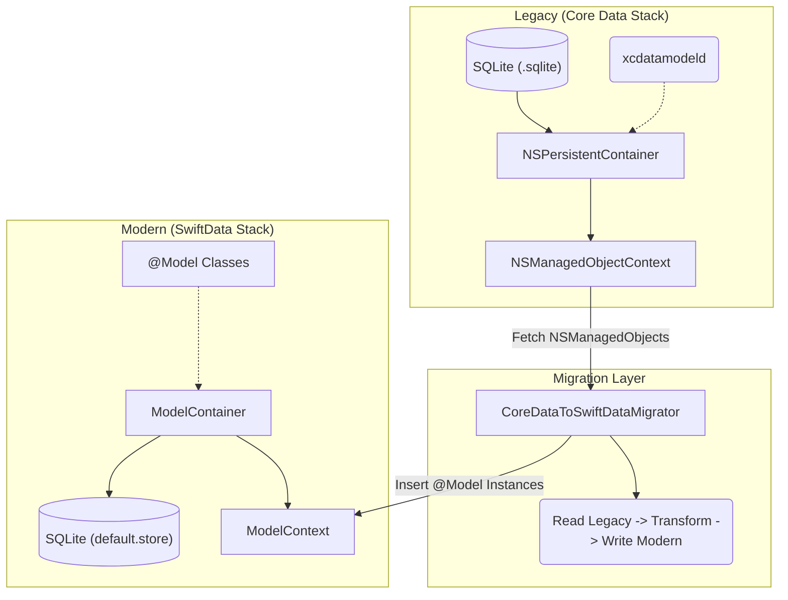
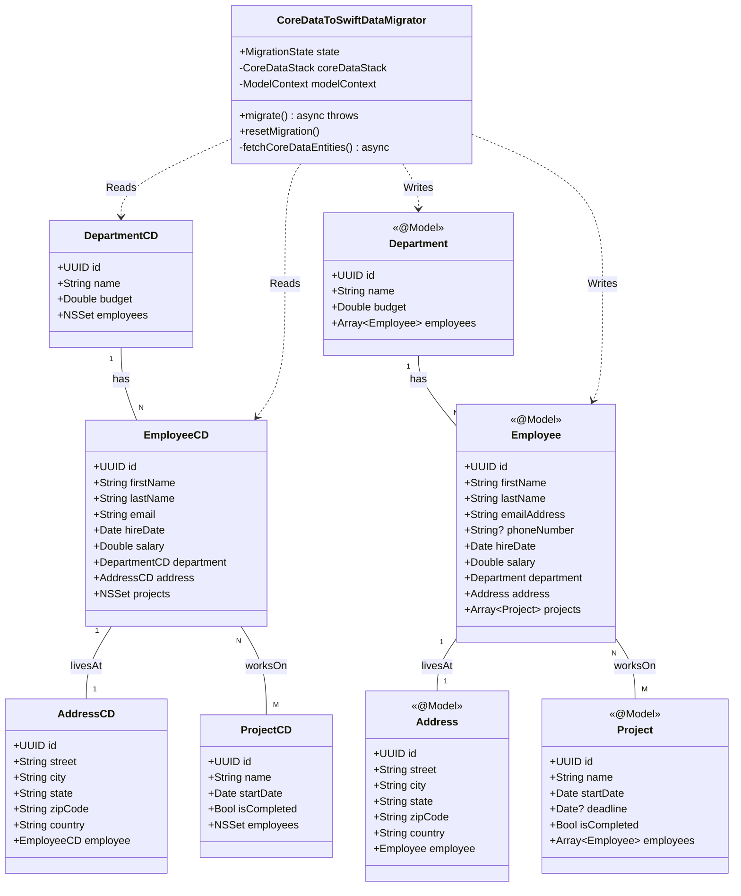
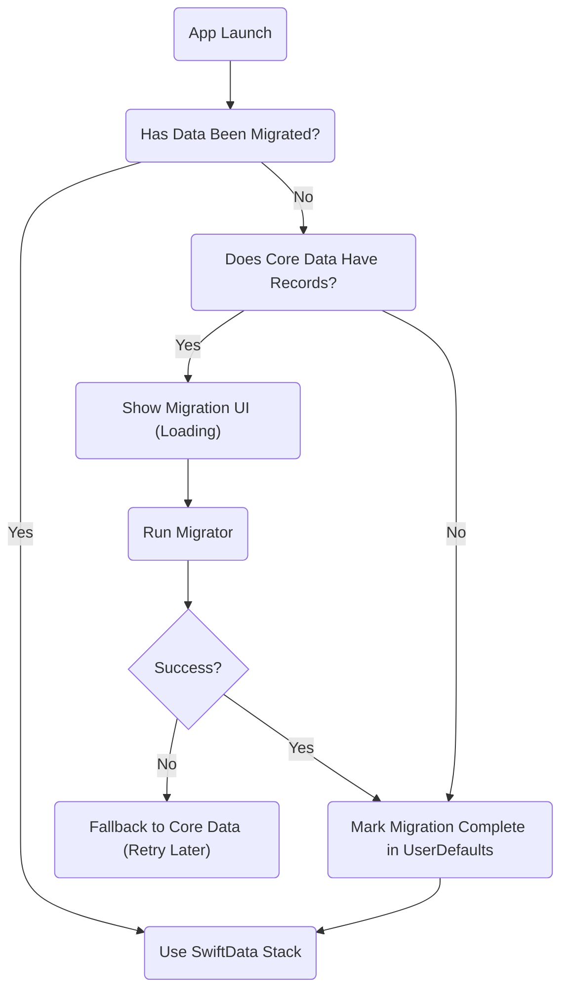
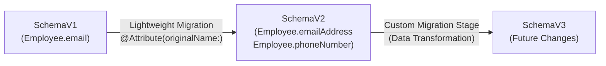

# 🎯 Migrating Enterprise Apps from Core Data to SwiftData: A Comprehensive Guide

Are you still wrestling with `.xcdatamodeld` files, manual relationship inverses, and stringly-typed predicates? It’s time to step into the future of iOS persistence. Apple’s introduction of **SwiftData** has fundamentally changed how we manage state and persist data in modern iOS applications, bringing compile-time safety and deep SwiftUI integration to the forefront.

In this comprehensive guide, we'll dive deep into migrating an enterprise-level app from Core Data to SwiftData. Whether you're planning a phased migration or a complete rewrite, this article provides the architecture, diagrams, and real-world code you need to succeed.

---

## 📖 What is SwiftData?

Introduced at WWDC 2023, SwiftData is Apple's native, declarative persistence framework designed specifically for Swift and SwiftUI. While it is built on the robust, battle-tested foundation of Core Data under the hood, it completely reimagines the developer experience.

Instead of relying on visual model editors and XML-backed `.xcdatamodeld` files, SwiftData uses Swift **macros** (specifically `@Model`) to define your schema directly in code. 

**Key Features:**
- **Declarative & Type-Safe:** Fully embraces Swift's type system, eliminating runtime crashes due to mistyped entity names or properties.
- **Deep SwiftUI Integration:** Works seamlessly with `@Query` and the environment to automatically update your UI when data changes.
- **Familiar Capabilities:** Supports CloudKit synchronization, undo/redo management, and autosaving natively.
- **Modern Requirements:** Requires iOS 17.0+ and macOS 14.0+.

> [!TIP]
> Think of SwiftData as a highly expressive, Swift-native wrapper around Core Data. You get all the performance benefits of Core Data without the boilerplate overhead.

---

## ⚔️ SwiftData vs Core Data

Before diving into migration, it's crucial to understand how the paradigms shift between the two frameworks.

### Feature Comparison

| Feature | Core Data | SwiftData |
| :--- | :--- | :--- |
| **Model Definition** | Visual Editor (`.xcdatamodeld`) + `NSManagedObject` | Code-first (`@Model` macro) |
| **Relationships** | Explicit manual inverse required | Automatic inverse generation |
| **Fetching** | `@FetchRequest` / `NSFetchRequest` | `@Query` / `FetchDescriptor` |
| **Context** | `NSManagedObjectContext` | `ModelContext` |
| **Stack Setup** | `NSPersistentContainer` | `ModelContainer` |
| **Concurrency** | Manual `perform` / `performAndWait` blocks | Native Swift Concurrency (Actors) |
| **Code Required** | Highly verbose, lots of boilerplate | Minimal, highly declarative |
| **Type Safety** | Runtime string evaluation | Compile-time checking |
| **SwiftUI Integration**| Partial (`@FetchRequest`) | Deep (`@Query`, Environment) |
| **Migration** | `NSMappingModel` / Lightweight | `VersionedSchema` + `SchemaMigrationPlan` |

### Code Comparison

Here is how a simple `Employee` entity looks in both frameworks:

**Core Data Approach:**
```swift
import CoreData

@objc(EmployeeCD)
public class EmployeeCD: NSManagedObject {
    @NSManaged public var id: UUID
    @NSManaged public var name: String
    @NSManaged public var role: String
    @NSManaged public var department: DepartmentCD?
}
```

**SwiftData Approach:**
```swift
import SwiftData

@Model
final class Employee {
    @Attribute(.unique) var id: UUID
    var name: String
    var role: String
    
    // Inverse relationship is automatic if defined on the other side
    var department: Department?
    
    init(id: UUID = UUID(), name: String, role: String) {
        self.id = id
        self.name = name
        self.role = role
    }
}
```

---

## 🚀 Why Migrate to SwiftData?

If your Core Data stack is working fine, why invest the resources to migrate?

1. **Massive Boilerplate Reduction:** SwiftData cuts boilerplate by roughly 60%. You focus on your domain logic, not on managing the persistence stack.
2. **Compile-Time Type Safety:** Predicates and sorts use `#Predicate` and keypaths. No more debugging `"name == %@"` runtime crashes.
3. **Native Concurrency:** Say goodbye to complex `managedObjectContext.perform { ... }` blocks. SwiftData uses `@ModelActor` to naturally fit into modern Swift Concurrency (`async/await`).
4. **First-Class SwiftUI:** The `@Query` macro and `@Environment(\.modelContext)` provide the cleanest UI-to-Data binding Apple has ever released.
5. **Simpler Relationships:** You rarely need to specify inverses manually; SwiftData handles the graph traversal for you.
6. **Robust Schema Evolution:** The new `VersionedSchema` and `SchemaMigrationPlan` make future migrations code-centric and testable.
7. **Future-Proofing:** It's the recommended path forward for Apple platforms.

> [!IMPORTANT]
> If your app supports iOS 16 or earlier, you cannot adopt SwiftData yet. A phased "Coexistence" strategy is required until your minimum deployment target is iOS 17+.

---

## 🏗️ How to Migrate — Architecture Guide

Migrating an enterprise app requires a structured approach. You cannot simply flip a switch. Let's look at the High-Level Design (HLD) and System-Level Design (SLD).

### High-Level Design (HLD)

This diagram illustrates the phased migration architecture, moving data from the legacy Core Data stack into the new SwiftData stack via a dedicated Migration Layer.



### System-Level Design (SLD)

Here is the class diagram showing the exact entities we will use for our Employee Management system, highlighting the relationships and the migrator service.



### The 6-Phase Migration Strategy

1. **Audit:** Catalog all Core Data entities, manual relationships, complex fetch requests, and previous migrations.
2. **Model:** Create exact equivalent `@Model` classes for each `NSManagedObject` subclass. Ensure you map the properties perfectly.
3. **Coexist:** For a period, run both stacks side-by-side. New features can use SwiftData, while legacy screens use Core Data.
4. **Migrate:** Build a migration script that reads all Core Data records, creates SwiftData equivalents, and manually re-links all relationships.
5. **Verify:** Validate data integrity. Count records on both sides to ensure no data loss occurred during migration.
6. **Cleanup:** Delete the Core Data stack, `.xcdatamodeld` file, and legacy classes once the migration is validated in production.

#### Migration Decision Flow



---

## 💻 Real-World Example: Employee Management System

To make this concrete, let's look at an **Enterprise Employee Management** app.

### The Domain Model
- **Department:** Contains many Employees (1:N).
- **Employee:** Belongs to a Department, has one Address (1:1), and works on multiple Projects (M:N).
- **Address:** Belongs to one Employee.
- **Project:** Has many Employees working on it.

### Core Data Implementation (Legacy)

```swift
// Legacy Core Data Class
@objc(EmployeeCD)
public class EmployeeCD: NSManagedObject {
    @NSManaged public var id: UUID
    @NSManaged public var name: String
    @NSManaged public var role: String
    
    @NSManaged public var department: DepartmentCD?
    @NSManaged public var address: AddressCD?
    @NSManaged public var projects: NSSet?
}
```

### SwiftData Implementation (Modern)

```swift
import SwiftData
import Foundation

@Model
final class Employee {
    @Attribute(.unique) var id: UUID
    var name: String
    var role: String
    
    // Relationships
    var department: Department?
    
    @Relationship(deleteRule: .cascade) 
    var address: Address?
    
    @Relationship(inverse: \Project.employees)
    var projects: [Project] = []
    
    init(id: UUID = UUID(), name: String, role: String) {
        self.id = id
        self.name = name
        self.role = role
    }
}
```

### The Migrator Logic

The heavy lifting happens in the migration layer. You must iterate through your legacy objects, instantiate new `@Model` objects, and resolve the relationships.

```swift
import CoreData
import SwiftData

final class CoreDataToSwiftDataMigrator {
    let coreDataContainer: NSPersistentContainer
    let swiftDataContainer: ModelContainer
    
    init(coreDataContainer: NSPersistentContainer, swiftDataContainer: ModelContainer) {
        self.coreDataContainer = coreDataContainer
        self.swiftDataContainer = swiftDataContainer
    }
    
    func migrate() async throws {
        let cdContext = coreDataContainer.viewContext
        let sdContext = ModelContext(swiftDataContainer)
        
        // 1. Fetch Core Data Employees
        let request: NSFetchRequest<EmployeeCD> = NSFetchRequest(entityName: "EmployeeCD")
        let cdEmployees = try cdContext.fetch(request)
        
        // 2. Dictionary to map old IDs to new Objects for relationship resolution
        var employeeMap: [UUID: Employee] = [:]
        
        // 3. Migrate Entities
        for cdEmployee in cdEmployees {
            let newEmployee = Employee(
                id: cdEmployee.id,
                name: cdEmployee.name,
                role: cdEmployee.role
            )
            sdContext.insert(newEmployee)
            employeeMap[cdEmployee.id] = newEmployee
            
            // Migrate Address (1:1)
            if let cdAddress = cdEmployee.address {
                let newAddress = Address(
                    id: cdAddress.id,
                    street: cdAddress.street,
                    city: cdAddress.city
                )
                sdContext.insert(newAddress)
                newEmployee.address = newAddress
            }
        }
        
        // 4. Save SwiftData Context
        try sdContext.save()
        
        // Note: Similar loops would be required for Departments and Projects, 
        // using the dictionaries to stitch the object graphs back together.
    }
}
```

### SwiftUI Integration

Once migrated, building UI is beautifully simple.

```swift
import SwiftUI
import SwiftData

struct EmployeeListView: View {
    // Replaces @FetchRequest
    @Query(sort: \Employee.name) private var employees: [Employee]
    @Environment(\.modelContext) private var context
    
    var body: some View {
        NavigationStack {
            List(employees) { employee in
                VStack(alignment: .leading) {
                    Text(employee.name).font(.headline)
                    Text(employee.role).font(.subheadline)
                }
            }
            .navigationTitle("Employees")
        }
    }
}
```

---

## 📝 Explaining the Example

Walking through the example above, you can see how drastically SwiftData reduces overhead.

In the legacy stack, we needed `.xcdatamodeld` files, manual code generation for `NSManagedObject` subclasses, and string-based entity names which are prone to typos (`"EmployeeCD"`).

In SwiftData, the `@Model` macro takes a standard Swift class and dynamically generates the schema for you. Notice how we use `@Relationship(deleteRule: .cascade)` on the `Address`. This ensures that when an `Employee` is deleted, their specific `Address` is also removed from the database, mimicking Core Data's cascade delete rule.

The `CoreDataToSwiftDataMigrator` acts as a bridge. Because Core Data and SwiftData use different underlying SQLite schemas, you generally cannot just point SwiftData at a Core Data `.sqlite` file reliably for complex graphs. The safest enterprise approach is to read the old data and write to a newly initialized SwiftData store, explicitly mapping relationships using UUIDs.

---

## 🔮 Managing Future Migrations with SwiftData

One of the most powerful aspects of SwiftData is how it handles schema evolution *after* you've migrated. Core Data's `.xcdatamappingmodel` files were notoriously difficult to merge in Git and hard to test. SwiftData brings migration entirely into code.

Let's say in a future release, we need to add a `phoneNumber` to `Employee` and rename `email` to `emailAddress`.

### VersionedSchema

You define explicit schema versions implementing the `VersionedSchema` protocol.

```swift
import SwiftData

// Schema V1
enum EmployeeSchemaV1: VersionedSchema {
    static var versionIdentifier = Schema.Version(1, 0, 0)
    static var models: [any PersistentModel.Type] { [EmployeeV1.self] }
    
    @Model final class EmployeeV1 {
        var id: UUID
        var name: String
        var email: String
        
        init(id: UUID, name: String, email: String) { 
            self.id = id
            self.name = name
            self.email = email
        }
    }
}

// Schema V2
enum EmployeeSchemaV2: VersionedSchema {
    static var versionIdentifier = Schema.Version(2, 0, 0)
    static var models: [any PersistentModel.Type] { [EmployeeV2.self] }
    
    @Model final class EmployeeV2 {
        var id: UUID
        var name: String
        @Attribute(originalName: "email") var emailAddress: String // Renaming
        var phoneNumber: String? // New property
        
        init(id: UUID, name: String, emailAddress: String, phoneNumber: String? = nil) { 
            self.id = id
            self.name = name
            self.emailAddress = emailAddress
            self.phoneNumber = phoneNumber
        }
    }
}
```

### SchemaMigrationPlan

To instruct SwiftData on how to transition between these schemas, you use a `SchemaMigrationPlan`.

```swift
enum EmployeeMigrationPlan: SchemaMigrationPlan {
    static var schemas: [any VersionedSchema.Type] {
        [EmployeeSchemaV1.self, EmployeeSchemaV2.self]
    }
    
    static var stages: [MigrationStage] {
        [migrateV1toV2]
    }
    
    // Lightweight Migration Stage
    static let migrateV1toV2 = MigrationStage.lightweight(
        fromVersion: EmployeeSchemaV1.self,
        toVersion: EmployeeSchemaV2.self
    )
    
    // Example of a custom stage if you needed complex data transformation:
    // static let customStage = MigrationStage.custom(...) { context in ... }
}
```

### Migration Flow Diagram



This code-centric approach means your migrations are now easily reviewed in Pull Requests and can be thoroughly unit tested without launching UI.

---

## ✅ Key Takeaways & Conclusion

Migrating an enterprise application from Core Data to SwiftData is a significant architectural decision, but the benefits are undeniable. By adopting SwiftData, you are buying into:

1. **Modern Swift paradigms:** Macros, Actors, and Async/Await.
2. **Reduced Maintenance:** Less boilerplate and fewer file types (`.xcdatamodeld` is gone).
3. **Superior Developer Experience:** Compile-time safety and declarative UI bindings.

**Your Action Plan:**
1. Assess your current Core Data graph complexity.
2. Ensure your minimum deployment target can hit iOS 17+.
3. Build the `CoreDataToSwiftDataMigrator` script to safely transition your users' data locally.
4. Implement `VersionedSchema` from Day 1 to ensure smooth future updates.

The persistence layer is the beating heart of most enterprise apps. By transitioning to SwiftData, you are setting your codebase up for the next decade of Apple platform development.

---

*Did you find this guide helpful? Drop a 🚀 in the comments, share it with your iOS team, and let me know your thoughts on SwiftData!*

#iOSDevelopment #SwiftUI #SwiftData #CoreData #SoftwareArchitecture #MobileDevelopment #Apple
