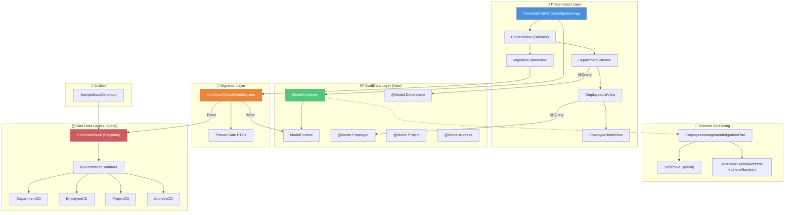
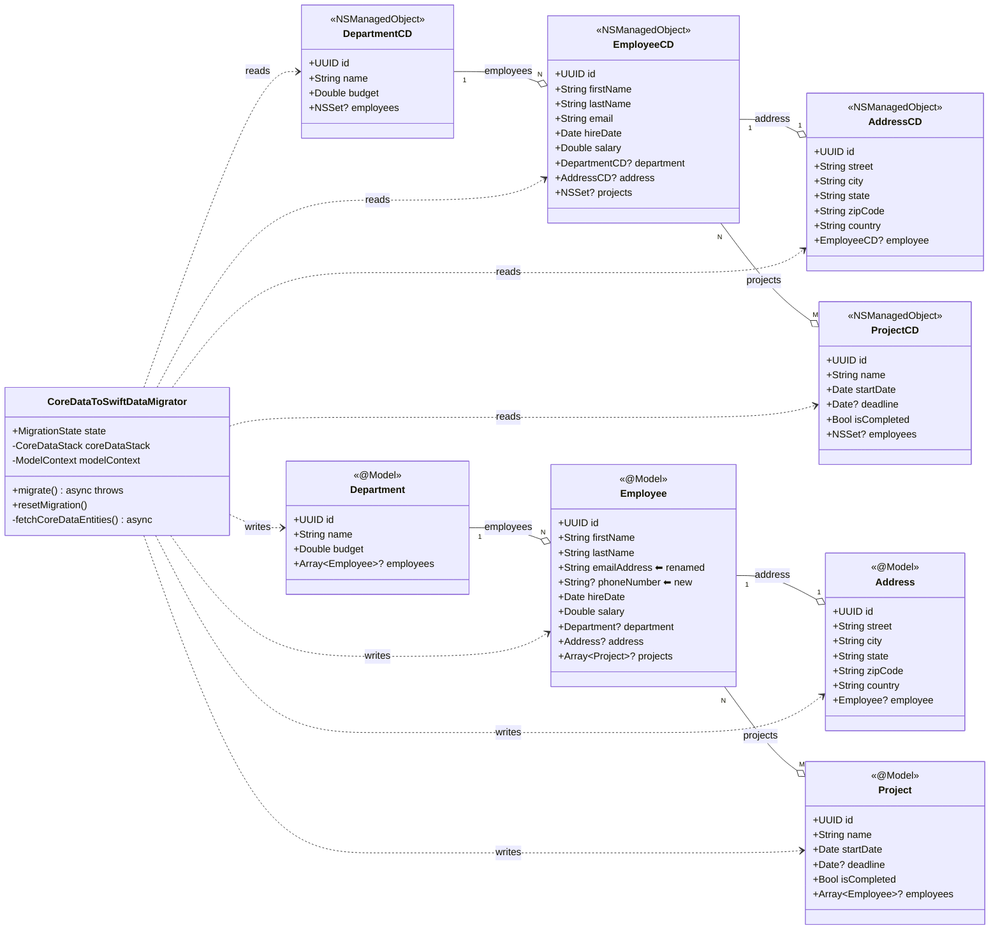
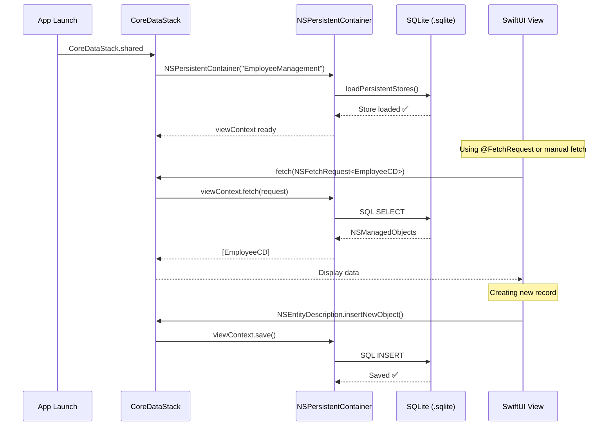
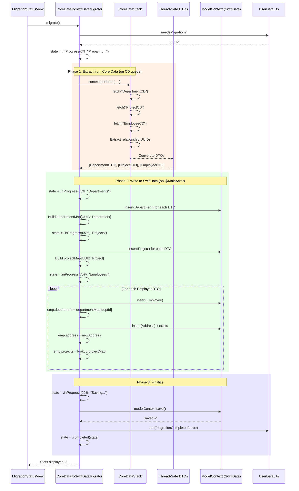
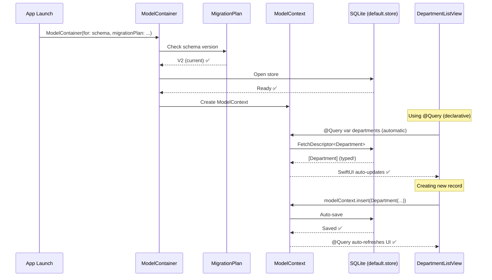
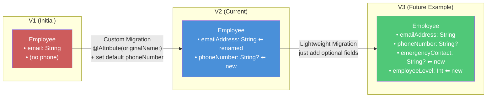
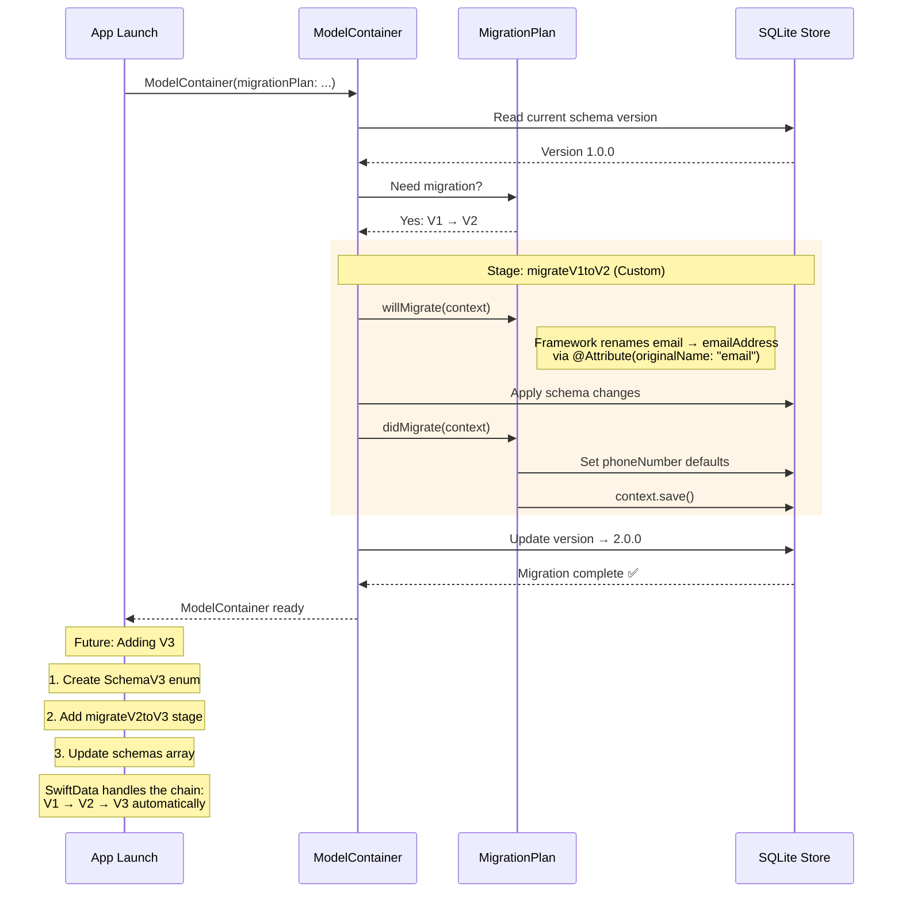
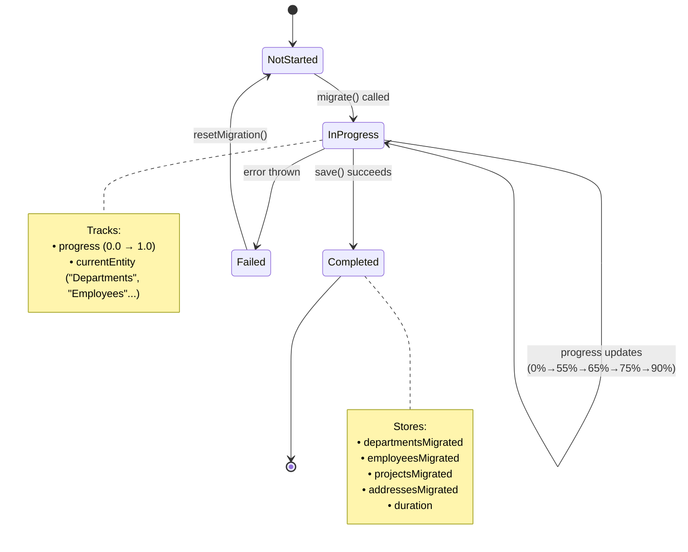

# 🔬 Deep Dive: Building a Core Data to SwiftData Migration System — Architecture & Code Walkthrough

*Ever wondered what a production-grade migration from Core Data to SwiftData actually looks like under the hood?*

In my [previous article](#), I covered the **why** and **what** of migrating to SwiftData. Now, let's roll up our sleeves and examine the **how** — a complete architectural deep dive into a real Employee Management System that demonstrates every moving part of the migration.

This article walks through the actual source code, explains the architecture with **HLD, SLD, and Sequence Diagrams**, and most importantly, shows you how the system handles **three timelines**: Before Migration (Core Data), During Migration, and After Migration (SwiftData + Future Schema Evolution).

📂 **Full source code:** [GitHub — CoreDataToSwiftDataMigration](https://github.com/anthropics/CoreDataToSwiftDataMigration)

---

## 📐 Project Architecture Overview

Before we dive into code, let's understand the system from the top down.

### High-Level Design (HLD)

The project is organized into **6 layers**, each with a clear responsibility. This separation allows the Core Data and SwiftData stacks to coexist during the transition period.



> **Key Insight:** The Migration Layer acts as a bridge between the two worlds. It reads from Core Data on its queue, converts to thread-safe DTOs, then writes to SwiftData on the main actor. The two persistence stacks **never directly interact**.

---

### System-Level Design (SLD) — Entity Relationships

The domain model contains **all three relationship types** found in real enterprise apps:



Notice the key differences between the **left (Core Data)** and **right (SwiftData)** sides:

| Aspect | Core Data | SwiftData |
|--------|-----------|-----------|
| Email field | `email: String` | `emailAddress: String` (renamed via `@Attribute(originalName:)`) |
| Phone | ❌ Not present | `phoneNumber: String?` (new in V2) |
| Relationships | `NSSet?` (untyped) | `[Employee]?` (typed arrays) |
| Definitions | `.xcdatamodeld` XML + NSManagedObject | `@Model` classes in pure Swift |

---

## ⏳ Timeline 1: BEFORE Migration — The Core Data World

### How the Core Data Stack Works



**The Core Data Stack** (`CoreDataStack.swift`) is a classic singleton pattern:

```swift
public class CoreDataStack {
    public static let shared = CoreDataStack()
    
    public lazy var persistentContainer: NSPersistentContainer = {
        let container = NSPersistentContainer(name: "EmployeeManagement")
        container.loadPersistentStores { (_, error) in
            if let error = error as NSError? {
                fatalError("Unresolved error \(error)")
            }
        }
        container.viewContext.automaticallyMergesChangesFromParent = true
        return container
    }()
    
    public var viewContext: NSManagedObjectContext {
        return persistentContainer.viewContext
    }
}
```

**The Entity Definitions** live in an XML file (`EmployeeManagement.xcdatamodeld`), requiring:
- Manual `@objc(EmployeeCD)` class annotations
- `@NSManaged` property declarations
- Explicit relationship inverses
- String-based entity names (`"EmployeeCD"`) in fetch requests

> **Pain Point:** A single typo in an entity name (e.g., `"Employee"` instead of `"EmployeeCD"`) causes a **runtime crash**, not a compile-time error. We caught exactly this issue during our code review!

---

## 🔀 Timeline 2: DURING Migration — The Bridge

This is where the magic happens. The `CoreDataToSwiftDataMigrator` orchestrates a safe, tracked, one-time data transfer.

### Migration Sequence Diagram



### Why the DTO Pattern?

This is a critical architectural decision. You **cannot** access `NSManagedObject` properties on the main thread and `ModelContext` on a background thread. The solution:

```
┌─────────────────────┐    ┌──────────────────┐    ┌─────────────────────┐
│   Core Data Queue   │───▶│   DTOs (Structs) │───▶│   @MainActor Queue  │
│                     │    │   Thread-safe     │    │                     │
│ NSManagedObject     │    │ DepartmentDTO     │    │ @Model Department   │
│ (not thread-safe)   │    │ EmployeeDTO       │    │ @Model Employee     │
│                     │    │ ProjectDTO        │    │ @Model Project      │
│                     │    │ AddressDTO        │    │ @Model Address      │
└─────────────────────┘    └──────────────────┘    └─────────────────────┘
```

The DTO structs are simple value types with no thread-affinity:

```swift
private struct EmployeeDTO {
    let id: UUID
    let firstName: String
    let lastName: String
    let email: String           // Core Data field name
    let hireDate: Date
    let salary: Double
    let departmentId: UUID?     // Relationship → just the UUID
    let address: AddressDTO?    // Nested DTO for 1:1
    let projectIds: [UUID]      // M:N → array of UUIDs
}
```

### Relationship Reconstruction with UUID Maps

The trickiest part of migration is preserving relationships. Since Core Data and SwiftData objects live in different object graphs, we use **UUID-keyed dictionaries** as a bridge:

```swift
// Build maps during creation
var departmentMap: [UUID: Department] = [:]
var projectMap: [UUID: Project] = [:]

// When creating employees, resolve relationships via UUID lookup
if let deptId = dto.departmentId {
    emp.department = departmentMap[deptId]  // 1:N ✅
}
emp.address = Address(...)                  // 1:1 ✅
emp.projects = dto.projectIds.compactMap {  // M:N ✅
    projectMap[$0]
}
```

---

## ✨ Timeline 3: AFTER Migration — The SwiftData World

### How SwiftData Serves the UI



**The key difference:** No manual fetch requests. No string-typed entity names. No manual save calls. The `@Query` macro handles everything declaratively:

```swift
struct DepartmentListView: View {
    // This ONE line replaces ~15 lines of Core Data @FetchRequest setup
    @Query(sort: \Department.name) private var departments: [Department]
    @Environment(\.modelContext) private var modelContext
    
    var body: some View {
        NavigationStack {
            List(departments) { dept in
                NavigationLink(value: dept) {
                    VStack(alignment: .leading) {
                        Text(dept.name).font(.headline)
                        Text(dept.budget, format: .currency(code: "USD"))
                            .font(.subheadline)
                    }
                }
            }
        }
    }
}
```

---

## 🔮 Timeline 4: FUTURE — Managing Schema Evolution

This is where SwiftData truly shines. When your schema evolves **after** the initial migration, you don't need to write a new migrator. You use `VersionedSchema` + `SchemaMigrationPlan`.

### Schema Evolution Flow



### How VersionedSchema Works

Each version snapshot captures the schema at a point in time:

```swift
// V1: Matches the original Core Data schema
enum SchemaV1: VersionedSchema {
    static var versionIdentifier = Schema.Version(1, 0, 0)
    static var models: [any PersistentModel.Type] {
        [Department.self, Employee.self, Address.self, Project.self]
    }
    
    @Model final class Employee {
        var email: String       // ← Original field name
        // No phoneNumber field
    }
}

// V2: Current active schema
enum SchemaV2: VersionedSchema {
    static var versionIdentifier = Schema.Version(2, 0, 0)
    static var models: [any PersistentModel.Type] {
        [Department.self, Employee.self, Address.self, Project.self]
    }
    // References the top-level @Model classes (latest version)
}
```

### The Migration Plan

```swift
enum EmployeeManagementMigrationPlan: SchemaMigrationPlan {
    static var schemas: [any VersionedSchema.Type] {
        [SchemaV1.self, SchemaV2.self]
    }
    
    static var stages: [MigrationStage] {
        [migrateV1toV2]
    }
    
    static let migrateV1toV2 = MigrationStage.custom(
        fromVersion: SchemaV1.self,
        toVersion: SchemaV2.self,
        willMigrate: { context in
            // Pre-migration: framework handles rename via @Attribute(originalName:)
        },
        didMigrate: { context in
            // Post-migration: set defaults for new fields
            let employees = try context.fetch(FetchDescriptor<Employee>())
            for employee in employees {
                if employee.phoneNumber == nil {
                    employee.phoneNumber = "000-000-0000"
                }
            }
            try context.save()
        }
    )
}
```

### Future Migration Sequence



> **🎯 Key Takeaway:** When adding V3 in the future, you only need three things:
> 1. Create a `SchemaV3` enum
> 2. Add a `migrateV2toV3` stage (lightweight or custom)
> 3. Append both to the migration plan's arrays
>
> SwiftData **automatically chains** migrations: a user on V1 will migrate V1→V2→V3 sequentially.

---

## 🗂️ Complete Project Structure

```
CoreDataToSwiftDataMigration/
│
├── 📱 App/
│   └── CoreDataToSwiftDataMigrationApp.swift    ← ModelContainer + MigrationPlan setup
│
├── 🗄️ CoreData/ (Legacy)
│   ├── CoreDataStack.swift                       ← NSPersistentContainer singleton
│   ├── EmployeeManagement.xcdatamodeld/          ← XML schema definition
│   └── Models/
│       ├── DepartmentCD+Extensions.swift         ← NSManagedObject subclass
│       ├── EmployeeCD+Extensions.swift
│       ├── ProjectCD+Extensions.swift
│       └── AddressCD+Extensions.swift
│
├── 📦 SwiftData/ (Modern)
│   ├── Models/
│   │   ├── Department.swift                      ← @Model, 1:N cascade
│   │   ├── Employee.swift                        ← @Model, @Attribute(originalName:)
│   │   ├── Project.swift                         ← @Model, M:N relationship
│   │   └── Address.swift                         ← @Model, 1:1 relationship
│   └── Schema/
│       ├── SchemaV1.swift                        ← VersionedSchema (initial)
│       ├── SchemaV2.swift                        ← VersionedSchema (current)
│       └── MigrationPlan.swift                   ← SchemaMigrationPlan
│
├── 🔀 Migration/
│   └── CoreDataToSwiftDataMigrator.swift         ← DTO pattern, @Observable
│
├── 🎨 Views/
│   ├── ContentView.swift                         ← TabView
│   ├── DepartmentListView.swift                  ← @Query, CRUD
│   ├── EmployeeListView.swift                    ← Search, navigation
│   ├── EmployeeDetailView.swift                  ← @Bindable, relationships
│   └── MigrationStatusView.swift                 ← Progress tracking
│
└── 🧪 Utilities/
    └── SampleDataGenerator.swift                 ← Test data in Core Data
```

---

## 🧬 Before vs After — Side-by-Side Code Comparison

### Defining a Model

```swift
// ❌ BEFORE: Core Data (3 files needed)
// File 1: .xcdatamodeld (XML visual editor)
// File 2: NSManagedObject subclass
@objc(EmployeeCD)
public class EmployeeCD: NSManagedObject {
    @NSManaged public var id: UUID
    @NSManaged public var firstName: String
    @NSManaged public var lastName: String
    @NSManaged public var email: String
    @NSManaged public var department: DepartmentCD?
    @NSManaged public var address: AddressCD?
    @NSManaged public var projects: NSSet?  // Untyped!
}
// File 3: Extension with computed properties & fetchRequest()
```

```swift
// ✅ AFTER: SwiftData (1 file, complete)
@Model
final class Employee {
    @Attribute(.unique) var id: UUID
    var firstName: String
    var lastName: String
    @Attribute(originalName: "email")
    var emailAddress: String                           // Renamed!
    var phoneNumber: String?                           // New!
    var department: Department?
    @Relationship(deleteRule: .cascade, inverse: \Address.employee)
    var address: Address?
    @Relationship(inverse: \Project.employees)
    var projects: [Project]? = []                      // Typed!
}
```

### Fetching Data in SwiftUI

```swift
// ❌ BEFORE: Core Data
@FetchRequest(
    sortDescriptors: [NSSortDescriptor(keyPath: \DepartmentCD.name, ascending: true)],
    animation: .default
)
private var departments: FetchedResults<DepartmentCD>
```

```swift
// ✅ AFTER: SwiftData
@Query(sort: \Department.name)
private var departments: [Department]
```

### Creating a New Record

```swift
// ❌ BEFORE: Core Data
let dept = NSEntityDescription.insertNewObject(forEntityName: "DepartmentCD", into: context)
dept.setValue(UUID(), forKey: "id")         // String-typed key! 💀
dept.setValue("Engineering", forKey: "name")
dept.setValue(1500000.0, forKey: "budget")
try context.save()
```

```swift
// ✅ AFTER: SwiftData
let dept = Department(name: "Engineering", budget: 1_500_000.0)
modelContext.insert(dept)
// Auto-saves! No manual save needed
```

---

## 📊 Migration State Machine

The migrator uses a state machine to track progress, which the UI observes via `@Observable`:



---

## ⚡ Key Architectural Decisions & Lessons Learned

### 1. Thread Safety via DTOs, Not Direct Object Passing

❌ **Wrong:** Passing `NSManagedObject` to `@MainActor` context
✅ **Right:** Convert to value-type DTOs on Core Data's queue, then create `@Model` objects on main actor

### 2. UUID-Based Relationship Mapping

❌ **Wrong:** Trying to look up objects by Core Data `NSManagedObjectID`
✅ **Right:** Every entity has a `UUID id` — use `[UUID: SwiftDataModel]` dictionaries to reconstruct the object graph

### 3. UserDefaults Guard for One-Time Migration

The migration checks `UserDefaults` before running, ensuring it only executes once:

```swift
var needsMigration: Bool {
    !UserDefaults.standard.bool(forKey: "CoreDataToSwiftDataMigrationCompleted")
}
```

### 4. `@Attribute(originalName:)` for Field Renames

Instead of writing complex data transformation code, SwiftData handles field renames declaratively:

```swift
@Attribute(originalName: "email")
var emailAddress: String  // SwiftData knows "email" → "emailAddress"
```

### 5. Custom Migration for Default Values

New non-optional fields need defaults for existing records. The `didMigrate` closure handles this:

```swift
didMigrate: { context in
    let employees = try context.fetch(FetchDescriptor<Employee>())
    for employee in employees {
        if employee.phoneNumber == nil {
            employee.phoneNumber = "000-000-0000"
        }
    }
    try context.save()
}
```

---

## 🎬 Summary — The Three Timelines

| Timeline | Stack | Relationships | Schema Changes | Type Safety |
|----------|-------|---------------|----------------|-------------|
| **Before** (Core Data) | NSPersistentContainer + xcdatamodeld | NSSet (untyped), manual inverse | NSMappingModel (XML) | Runtime ❌ |
| **During** (Migration) | Both stacks + Migrator + DTOs | UUID-based mapping dictionaries | N/A (one-time transfer) | DTO contracts ⚠️ |
| **After** (SwiftData) | ModelContainer + @Model | Typed arrays, auto-inverse | VersionedSchema + SchemaMigrationPlan | Compile-time ✅ |
| **Future** (Schema V3+) | Same ModelContainer | Same typed approach | Add schema + stage → auto-chains | Compile-time ✅ |

---

## 🚀 Try It Yourself

1. Clone the repo
2. Open `CoreDataToSwiftDataMigration.xcodeproj` in Xcode 15+
3. Run on iOS 17+ Simulator
4. Go to **Migration tab** → **Generate Sample Core Data** → **Start Migration**
5. Switch to **Departments tab** — you'll see all migrated data with relationships intact!

📂 **Source code:** [GitHub — CoreDataToSwiftDataMigration](https://github.com/anthropics/CoreDataToSwiftDataMigration)

---

*Found this deep dive useful? Share it with your iOS team and follow me for more architecture-level content on Swift, SwiftUI, and system design!*

#iOSDevelopment #SwiftData #CoreData #SoftwareArchitecture #SystemDesign #SwiftUI #MobileDevelopment #Apple #TechDeepDive
